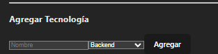
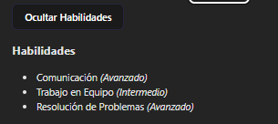
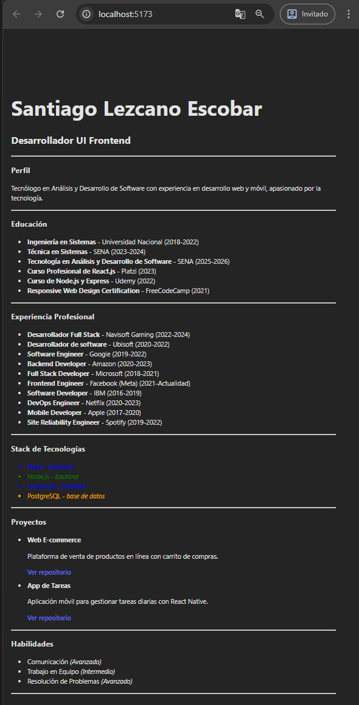
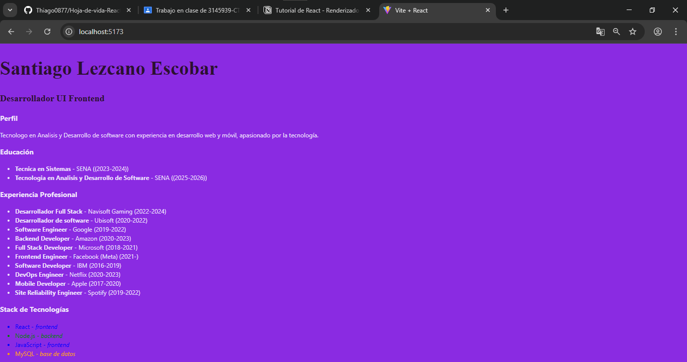
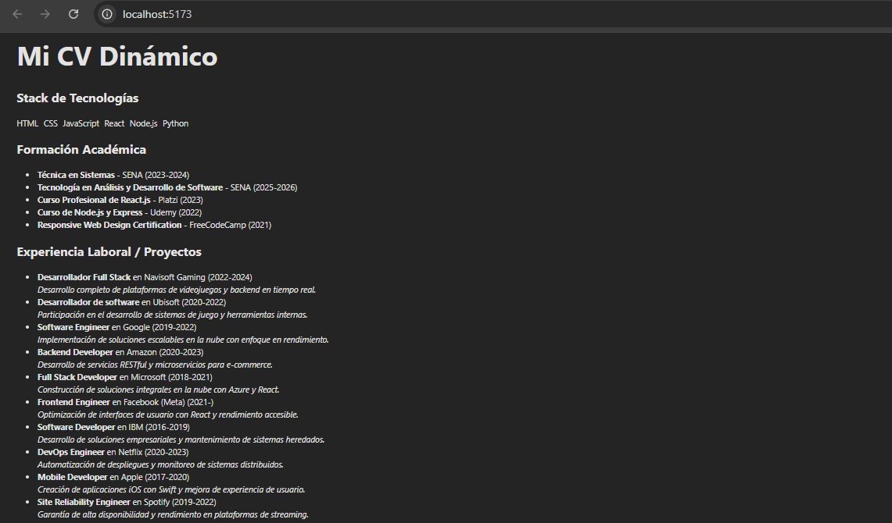

# React + Vite

This template provides a minimal setup to get React working in Vite with HMR and some ESLint rules.

Currently, two official plugins are available:

- [@vitejs/plugin-react](https://github.com/vitejs/vite-plugin-react/blob/main/packages/plugin-react) uses [Babel](https://babeljs.io/) for Fast Refresh
- [@vitejs/plugin-react-swc](https://github.com/vitejs/vite-plugin-react/blob/main/packages/plugin-react-swc) uses [SWC](https://swc.rs/) for Fast Refresh

## Expanding the ESLint configuration

If you are developing a production application, we recommend using TypeScript with type-aware lint rules enabled. Check out the [TS template](https://github.com/vitejs/vite/tree/main/packages/create-vite/template-react-ts) for information on how to integrate TypeScript and [`typescript-eslint`](https://typescript-eslint.io) in your project.


## Nombre del proyecto:
Hoja de Vida React

## Descripción del Ejercicio
En este ejercicio construimos una hoja de vida dinámica utilizando React. Aprendimos a reutilizar componentes mediante el uso de **props** y **desestructuración**, permitiendo una mejor organización, escalabilidad y mantenimiento del código.

Posteriormente, se integraron funcionalidades interactivas utilizando **eventos** y **estado local (useState)** para mejorar la experiencia del usuario. Se implementaron componentes controlados que permiten mostrar/ocultar secciones y agregar datos dinámicamente mediante formularios.

## Componentes reutilizables implementados:
- `CabeceraCV.jsx` → Recibe: nombre, cargo, ciudad, contacto
- `Perfil.jsx` → Recibe: resumen profesional
- `Experiencia.jsx` → Recibe: lista de experiencias (cargo, empresa, periodo)
- `Educacion.jsx` → Recibe: lista de estudios y talleres
- `StackTecnologias.jsx` → Renderiza lista de tecnologías (recibidas por props)
- `Proyectos.jsx` → Lista de proyectos destacados
- `Habilidades.jsx` → Lista de habilidades personales o técnicas

## Nuevas funcionalidades añadidas:
- `ToggleHabilidades.jsx` → Componente con botón para mostrar u ocultar dinámicamente el bloque de habilidades. Usa `useState` y renderizado condicional.
- `FormularioTecnologia.jsx` → Formulario controlado con `useState`, permite al usuario agregar nuevas tecnologías al stack. Maneja eventos `onChange` y `onSubmit`.

### Estado y lógica centralizados en App.jsx
- Se utiliza `useState` para:
  - Mostrar u ocultar el componente `Habilidades`
  - Almacenar y actualizar dinámicamente la lista de tecnologías
- Se pasa la función `agregarTecnologia` como prop al componente `FormularioTecnologia`
- El componente `StackTecnologias` ahora se actualiza en tiempo real con las nuevas tecnologías añadidas

## Capturas de pantalla
> Agrega aquí tus capturas con etiquetas como:

### 🖼️ Formulario para agregar tecnología


### 🎯 Habilidades mostradas/ocultas dinámicamente


## Instrucciones para ejecutar el proyecto

1. Clona el repositorio:
```bash
git clone https://github.com/tu-usuario/cv-react-nombre-aprendiz.git
cd cv-react-nombre-aprendiz





